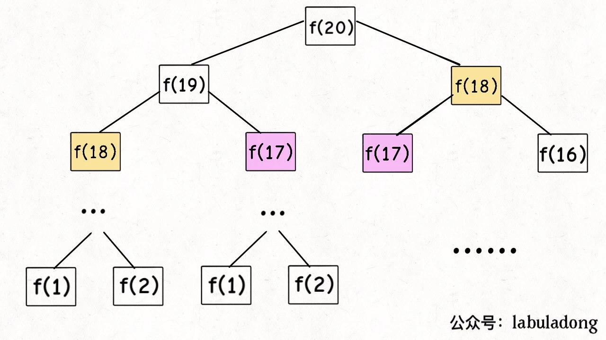
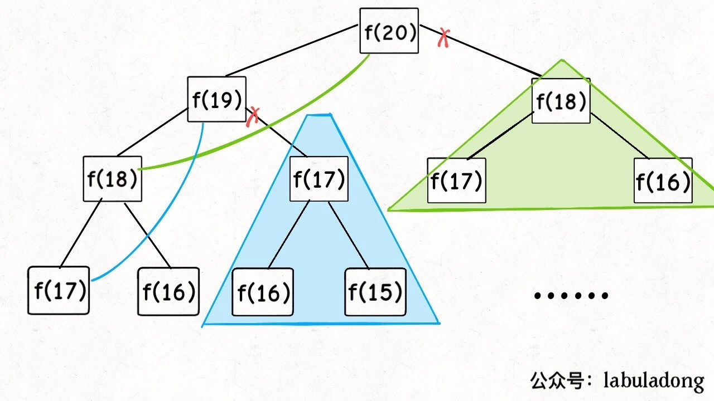
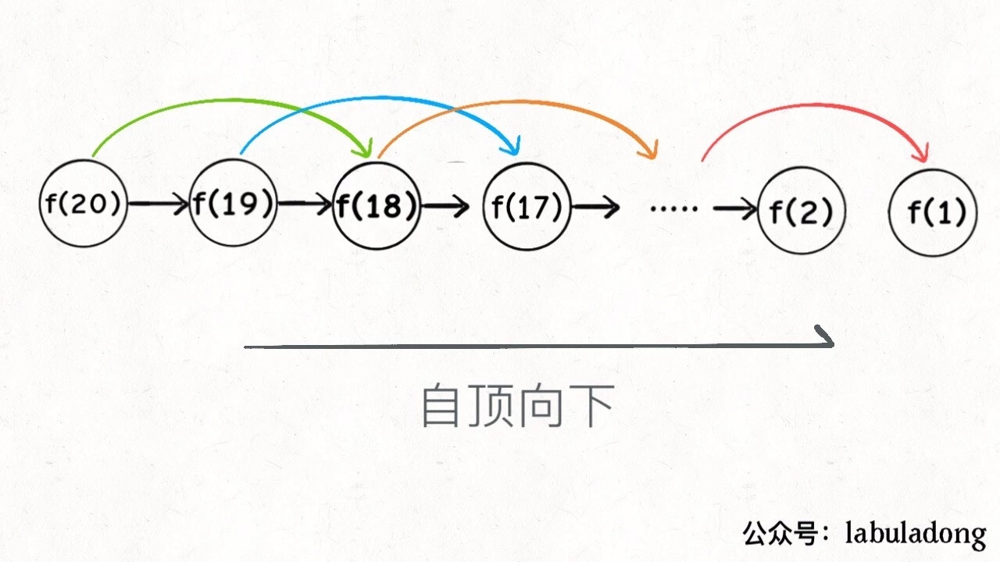
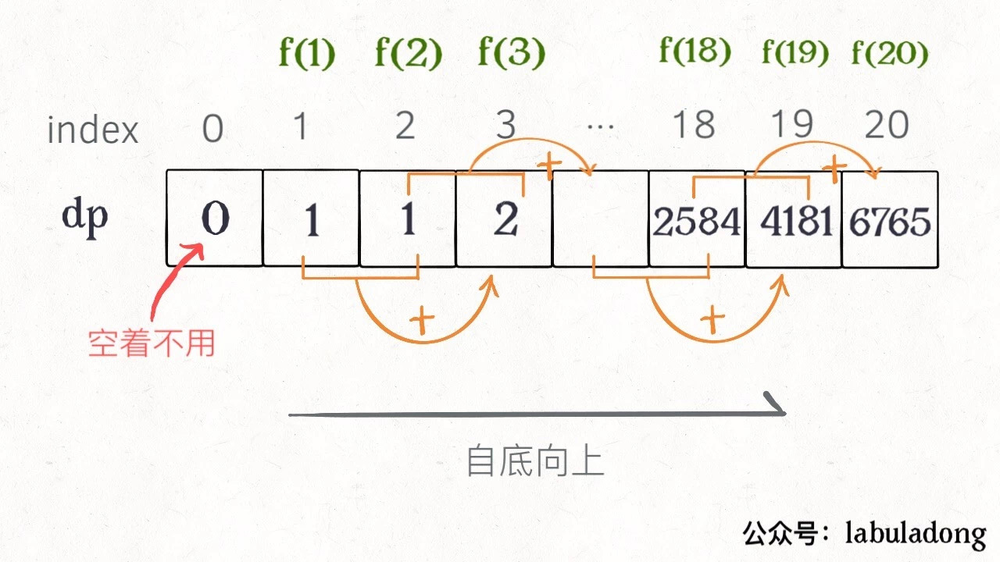

### 动态规划
> 动态规划问题的一般形式是求最值，如最长递增子序列、最小编辑距离。求解动态规划的核心问题是"穷举"。
> 动态规划的特点是存在重叠子问题，具备"最优子结构"，也就是通过子问题的最优值能得到原始问题的最值。
三要素
- 重叠子问题
- 最优子结构
- 状态转移方程（最困难）

#### 找出状态转移方程的关键思考点有如下几点：
- 问题的base case，也就是最简单的情况
- 问题中含有的状态
- 对于每个状态，可以作出何种选择使得状态发生改变
- 如何定义dp数组来表示"状态"和"选择"之间的关系，也就是找出函数表达式，即状态转移方程

#### 何为重叠子问题？
[leetcode 509 斐波那契数列问题](https://leetcode-cn.com/problems/fibonacci-number/)

```java
public int fib(int n) {
    if (n == 0) return 0;
    if (n == 1) return 1;
    return fib(n-1) + fib(n-2);
}
// 递归算法的度复杂度为O(2^n)
```

> 求解过程可以用一颗二叉树表示，从图中可以看出，算法低效的原因就是因为存在大量的重复计算，也就是重叠子问题。算法导论这本书里面就提到，解决重叠子问题的一种
> 方法就是可以通过一个备忘录来缓存已经计算过的子问题，这样在下次计算之前，可以先查询子问题是否已经被计算过，如果被计算狗，可以直接通过备忘录来直接获取。
```java
public int fib(int n) {
    if(n == 0) return 0;
    int[] memoCache = new int[n+1];

    return memoHelper(memoCache,n);

}
int memoHelper(int[] memoCache,int n) {
        if(n == 1 || n == 2) return 1;
        if(memoCache[n]!= 0 ) return memoCache[n];
        return  memoHelper(memoCache,n-1) + memoHelper(memoCache,n-2);
}

// 带备忘录的递归算法的度复杂度为O(n)
```


DP数组的迭代解法
```java
public int fib(int n) {
    if (n == 0) return 0;
    if (n == 1) return 1;
    int[] dp = new int[n+1];
    dp[1] = 1;
    dp[2] = 1;
    for(int i = 3; i <= n; i++) {
        dp[i] = dp[i-1] + dp[i-2];
    }

    return dp[n];
}
```
> 比较递归和dp数组的迭代解法可以看出，递归解法的一种自顶向下，而迭代是自底向上的。



$$\begin{cases}
a_1x+b_1y+c_1z=d_1\\
a_2x+b_2y+c_2z=d_2\\
a_3x+b_3y+c_3z=d_3\\
\end{cases}
$$

#### Related question
- [leetcode 70. 爬楼梯](https://leetcode-cn.com/problems/climbing-stairs/)


